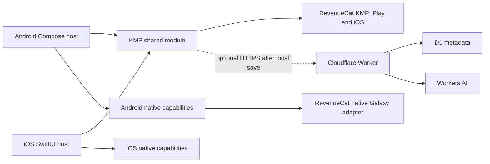

# Restart Thread KMP architecture

## Decision

Restart Thread uses Kotlin Multiplatform with selectively shared Compose UI.
Android remains the first release and evidence platform. The shared module owns
behavior that should remain identical on Android and iOS. OS capabilities and
store-specific adapters stay native.

Cloudflare is the selected remote service. The remote path remains optional at
runtime, and the app must save locally before attempting a remote call.

## Shared ownership

The `android/shared` module owns:

- recovery thread and draft models;
- deterministic first-step generation;
- capture, review, and started presentation state;
- the current capture/recovery Compose screen and its adaptive layout;
- RevenueCat customer information, `pro` entitlement state, Offering loading,
  Play/iOS Paywall, and Customer Center surfaces;
- the platform interface used by the presentation controller.

These choices make the product's core promise, provenance, and state behavior
portable without forcing every screen or capability into shared code.

## Native ownership

Each platform host owns:

- microphone permission and recording APIs;
- protected local storage and cryptographic key handling;
- lock-screen, widget, notification, shortcut, haptic, and sound surfaces;
- app lifecycle and platform navigation;
- accessibility behavior that requires native APIs;
- RevenueCat public app-key injection and store selection;
- Galaxy Store purchases and store-specific diagnostics through RevenueCat's
  native Galaxy adapter;
- platform review declarations and store submission configuration.

The Android implementation is in `android/app`. The future iOS implementation
conforms to `RestartThreadPlatform` in Swift and injects it into the shared
`MainViewController`.

## Dependency rule

The shared module may import RevenueCat's KMP core, result, and UI artifacts.
It must not import Android, UIKit, AVFoundation, StoreKit, Google Play Billing,
Samsung Checkout, or RevenueCat's native Galaxy artifact. Native hosts may
depend on the shared module. The shared module must never depend on a host.

Play and iOS use the shared RevenueCat KMP subscription path. Galaxy remains on
RevenueCat's native Android Galaxy configuration because the KMP integration
does not currently provide that store-specific setup. All stores map to the
same logical `pro` entitlement.

## Source map

| Responsibility | Location |
| --- | --- |
| Domain and deterministic recovery | `android/shared/src/commonMain/.../domain` |
| Cross-platform state controller | `android/shared/src/commonMain/.../presentation` |
| Selected shared Compose UI | `android/shared/src/commonMain/.../ui` |
| Play/iOS subscription controller | `android/shared/src/commonMain/.../billing` |
| Compose host for UIKit | `android/shared/src/iosMain/.../MainViewController.kt` |
| Android permission choreography | `android/app/.../MainActivity.kt` |
| Android vault and recorder adapter | `android/app/.../platform` and `data/local` |
| Play/Galaxy key and store configuration | `android/app/build.gradle.kts` |
| Native Galaxy RevenueCat adapter and UI | `android/app/src/galaxy/.../billing` |
| Selected remote boundary | `backend` |

## Next iOS slice

The first iOS slice should host the existing shared screen, implement the
platform interface with native recording and protected storage, and verify the
save-before-recovery invariant. Lock-screen capture and Apple purchases remain
separate proof slices after that. RevenueCat's shared UI is already wired; the
iOS host must inject its Apple public SDK key and set an iOS 15 deployment
target. This ordering does not change the Android-first release target.
