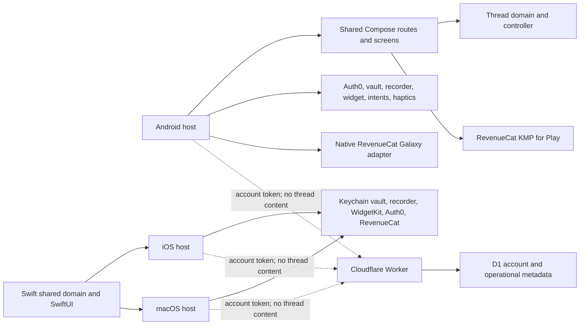

# Restart Thread KMP architecture

## Decision

Restart Thread uses Kotlin Multiplatform with selectively shared Compose UI on
Android and a native Swift package shared by the iOS and macOS apps. Product
behavior is equivalent across the implementations; operating-system and store
capabilities stay native.

## Shared ownership

`android/shared` owns:

- routes and per-screen state for onboarding, Now, capture, review, Start,
  history, detail, deletion, settings, and privacy;
- the one-current-thread rule and lifecycle transitions;
- recovery models and deterministic local first-step drafting;
- shared Compose design, accessibility semantics, and responsive layout;
- RevenueCat KMP Offering, `pro` entitlement, Paywall, Customer Center,
  purchase restoration, and identity changes;
- a small platform interface for storage, recording, export, and haptics.

## Native Android ownership

`android/app` owns:

- Auth0 Universal Login and secure credentials;
- microphone permission choreography and recording;
- Android Keystore encryption, file enumeration, and v1-to-v2 record decoding;
- launcher/adaptive/themed icons, Jetpack Glance widget, app intents, and
  pinning;
- lifecycle state restoration through `SavedStateHandle`;
- public configuration injection from ignored `local.properties`;
- Play and Galaxy store selection, with Galaxy's native RevenueCat adapter.

The vault remains file based. This screen expansion does not introduce a
database. Only one active record is retained; extra legacy active records are
normalized to archived during refresh.

## Identity and backend boundary

Auth0's stable `sub` becomes the RevenueCat App User ID after login. Logout
returns RevenueCat to an anonymous identity and retains all local threads.
Cloudflare validates the access-token signature, issuer, audience, expiry, and
scope before account allowance or deletion operations. D1 stores only a SHA-256
account key and content-free usage metadata. It never stores the Auth0 `sub`,
thread text, audio, or recovery output.

## Native Apple ownership

`apple/Sources/RestartThreadCore` owns the Apple route coordinator, recovery
models, deterministic draft, capture restoration, one-current-thread rule, and
AES-GCM file vault. `apple/Sources/RestartThreadApple` owns SwiftUI screens,
Auth0, RevenueCat, recording, export, haptics, and WidgetKit refreshes. The iOS
and macOS targets share those modules while keeping native app scenes,
entitlements, commands, and presentation behavior.

The Apple vault stores its symmetric key in a shared Keychain access group and
encrypted records in the app-group container. The widget has read access to the
same encrypted current thread. Auth0 credentials remain in Auth0's separate
Keychain storage. Apple signing, Universal Link association, real purchases,
and physical-device behavior still require owner-controlled accounts and
hardware.
