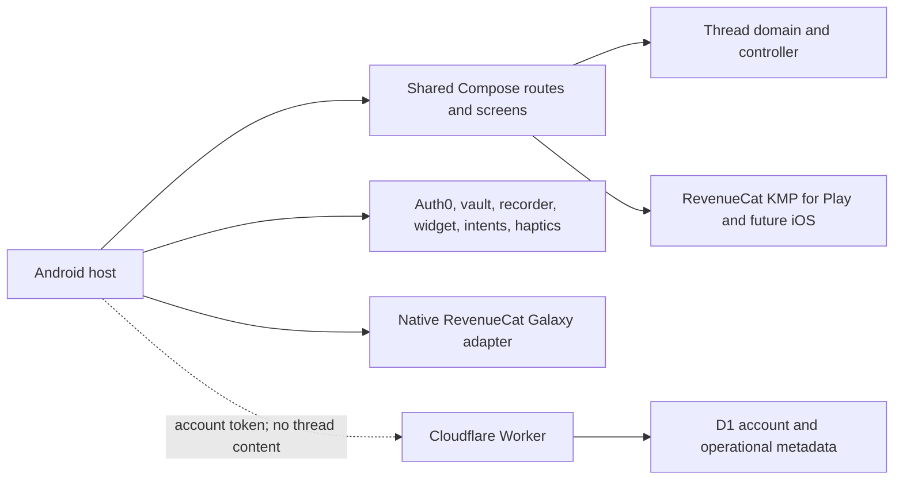

# Restart Thread KMP architecture

## Decision

Restart Thread uses Kotlin Multiplatform with selectively shared Compose UI.
Android remains the first release and evidence platform. Product behavior is
shared; operating-system and store capabilities stay native.

## Shared ownership

`android/shared` owns:

- routes and per-screen state for onboarding, Now, capture, review, Start,
  history, detail, deletion, settings, and privacy;
- the one-current-thread rule and lifecycle transitions;
- recovery models and deterministic local first-step drafting;
- shared Compose design, accessibility semantics, and responsive layout;
- RevenueCat KMP Offering, `pro` entitlement, Paywall, Customer Center,
  purchase restoration, and identity changes;
- a small platform interface for storage, recording, export, and haptics.

## Native Android ownership

`android/app` owns:

- Auth0 Universal Login and secure credentials;
- microphone permission choreography and recording;
- Android Keystore encryption, file enumeration, and v1-to-v2 record decoding;
- launcher/adaptive/themed icons, Jetpack Glance widget, app intents, and pinning;
- lifecycle state restoration through `SavedStateHandle`;
- public configuration injection from ignored `local.properties`;
- Play and Galaxy store selection, with Galaxy's native RevenueCat adapter.

The vault remains file based. This screen expansion does not introduce a
database. Only one active record is retained; extra legacy active records are
normalized to archived during refresh.

## Identity and backend boundary

Auth0's stable `sub` becomes the RevenueCat App User ID after login. Logout
returns RevenueCat to an anonymous identity and retains all local threads.
Cloudflare validates the access-token signature, issuer, audience, expiry, and
scope before account allowance or deletion operations. D1 stores only a SHA-256
account key and content-free usage metadata. It never stores the Auth0 `sub`,
thread text, audio, or recovery output.

## Later iOS work

The shared routes and UI are portable. The iOS host still needs native Auth0
presentation, Keychain/protected-file storage, recording, app links, haptics,
widgets or Live Activities, Apple RevenueCat configuration, signing, and device
proof. Android-specific code must not be moved into the shared module merely to
reduce file count.
