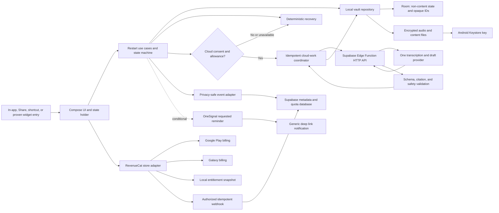

# Run 10 system blueprint

## Decision

Use one native Android application written in Kotlin with Jetpack Compose.
Target Android 16, API 36, from the first build. Keep Google Play and Galaxy
Store as Gradle product flavors over the same domain, UI, local-storage, and
HTTP code. The flavors contain only store identifiers, RevenueCat keys and
configuration, billing dependencies, and store-specific manifests.

This is a small ports-and-adapters boundary, not a multi-module architecture
program. A package boundary is sufficient until measured build or ownership
pressure justifies modules.

## Component and data flow



The non-negotiable ordering is:

```text
user input -> durable encrypted local save -> optional upload -> validated draft
-> user edit or confirmation -> verified Start
```

No network, purchase, analytics, or notification dependency may move ahead of
the durable local save.

## Android application shape

Use one activity and Compose navigation. The minimum package boundaries are:

- `ui`: screens, adaptive panes, semantics, visual tokens, motion policy;
- `domain`: state transitions, use cases, validation, immutable models;
- `data.local`: Room metadata, encrypted files, export, deletion;
- `data.remote`: the recovery HTTP client and response schema;
- `billing`: RevenueCat interface plus Play and Galaxy configuration;
- `platform`: recorder, foreground service, Share target, app shortcut, widget;
- `telemetry`: allowlisted events and redacted diagnostics.

Construct these dependencies in one explicit application container. Do not add
a dependency-injection framework merely to connect a single implementation of
each port.

## Core domain model

| Entity | Necessary fields | Owner | Content sensitivity |
|---|---|---|---|
| `Thread` | opaque ID, created time, state, ordinal | Device | Metadata |
| `CaptureArtifact` | type, local URI, duration, save state, hash | Device | Audio or text content |
| `TranscriptSegment` | opaque ID, text, source offsets | Device after response | Sensitive content |
| `RecoveryDraft` | version, confidence, assumptions, status | Device | Sensitive content |
| `Action` | text, order, source segment IDs, user-confirmed flag | Device | Sensitive content |
| `ProcessingAttempt` | opaque request ID, timestamps, status, error code | Device and server metadata | No content |
| `Reminder` | thread ordinal, scheduled time, provider message ID, state | Device and server metadata | No content |
| `EntitlementSnapshot` | `pro` state, store, expiry or grace metadata | RevenueCat cache and device | Purchase metadata |
| `QuotaLedger` | install token, rolling allowance counters, result code | Server | No content |
| `ProductEvent` | event name, opaque ordinals, version, duration bucket | Server | No content |

`Thread.state` follows the accepted product sequence:

```text
new -> capturing -> saved -> processing -> draft_ready -> edited_or_confirmed
-> started -> completed
```

Side paths are `cancelled`, `partial_save`, `offline_ready`,
`processing_failed`, `expired_result`, and `deleted`. An asynchronous result is
accepted only when its request ID and thread version still match. This prevents
an older retry from overwriting a newer edit.

## Local and server ownership

The device is the source of truth for the thread, raw capture, transcript,
draft, actions, history, and user edits. Store non-content state in Room and
content in app-private encrypted files. Generate a non-exportable AES key in
Android Keystore and use AES-256-GCM. Perform cryptography and file work away
from the main thread.

Exclude the local vault from Android Auto Backup. A restored RevenueCat cache
can help recover a subscription, but it must not make protected thread content
appear recoverable when its device key is gone. Export is explicit through the
Storage Access Framework to a destination the user chooses. Deletion removes
the local ciphertext, derived text, search index if one exists, and queued
work; it also cancels the matching reminder.

The server owns only what the shared operation requires:

- install-scoped opaque credential and abuse counters;
- feature flags and the current free cloud allowance;
- privacy-safe product events from the Run 9 taxonomy;
- RevenueCat webhook idempotency and entitlement audit metadata;
- OneSignal message IDs for conditional scheduled-reminder cancellation;
- request status, latency, cost, provider, and allowlisted error codes.

The server does not persist raw audio, transcript, draft, action, source text,
or export files. Provider processing is still a third-party disclosure: the
current OpenAI API documentation says default abuse-monitoring logs can retain
customer content for up to 30 days. The consent screen and policy must say this
unless the chosen account has a verified different retention control.

## Backend and API

Use Supabase Edge Functions and Postgres as one thin operational backend. The
Android client calls a versioned HTTPS endpoint; it does not receive service or
model-provider keys and does not get direct write access to operational tables.

The recovery endpoint must:

1. authenticate a resettable install-scoped credential;
2. enforce the remotely configured free or Pro allowance;
3. accept only the bounded 60-second audio or equivalent text payload;
4. call one transcription and draft provider;
5. validate a versioned JSON response, citation IDs, and product bounds;
6. return the result without storing content;
7. log only request ID, model, timings, token or audio units, status, and error;
8. support an idempotency key so a retry cannot double-charge allowance.

Do not build a general job queue, provider router, or public Supabase data API
for this slice. Supabase's free Edge Function wall-clock limit is 150 seconds
and its idle response timeout is 150 seconds. The cloud spike must measure the
real path; the product uses saved-thread and deterministic fallbacks rather
than asking the user to wait against that ceiling.

## Authentication

No account is required before first value. RevenueCat creates an anonymous app
user ID when the SDK is configured without a custom ID. The recovery service
uses a separate resettable install-scoped credential; it is not an identity or
a cross-device recovery promise.

The user can explicitly restore store subscriptions from Settings or the
paywall. RevenueCat warns that restore can invoke an operating-system account
prompt, so it is never automatic. The selected subscription-only catalog avoids
the Billing Client 8 anonymous-consumable restore limitation.

Optional account linking, cross-device thread sync, and referral identity are
post-submission work. If implemented later, one account identifier can be
passed to RevenueCat with `logIn`, but that transition requires a separate
privacy and merge design.

## RevenueCat and purchase lifecycle

Use:

- entitlement: `pro`;
- Offering: `default`;
- packages: monthly and annual;
- products: separate Play and Galaxy product IDs mapped to the same packages;
- native Android SDK: `purchases` and `purchases-ui` where useful;
- Galaxy flavor: add `purchases-store-galaxy` and configure
  `GalaxyConfiguration` with the Galaxy API key;
- Play flavor: configure the standard Android SDK with the Play API key.

The paywall is dismissible after the first verified value. A blocking offer is
allowed only before a new cloud request after the current free allowance is
used. Local capture, deterministic recovery, owned history, delete, export,
privacy, and accessibility remain available without `pro`.

Cache `CustomerInfo` for responsive UI but refresh it on foreground, purchase,
restore, and webhook-relevant transitions. During billing grace, preserve Pro
when RevenueCat reports an active entitlement. On expiry, stop new paid cloud
requests; do not hide or delete existing threads.

The server webhook verifies the configured authorization secret, stores the
RevenueCat event ID before applying a change, and treats delivery as at least
once. It stores purchase metadata only, never thread content. A restore control
remains visible in both store builds.

## Notifications and feature flags

OneSignal is conditional evidence-enhancing scope. Request notification
permission only after a verified value and an explicit request for one useful
reminder. Store the returned OneSignal message ID. Cancel it when the user
starts, completes, deletes, replaces, or opts out of the thread. A raced or
stale deep link opens a neutral current-state screen, not private content.

Use a small server table for feature flags rather than another SDK. Necessary
flags are the free cloud allowance, cloud kill switch, OneSignal path, Galaxy
experimental entry, and AI provider model version. Cache the last known safe
values locally. Failure defaults to local and deterministic recovery.

## Permissions, privacy, secrets, and transport

- Request `RECORD_AUDIO` only when the user chooses voice.
- Start recording from a user-visible action and show recording state.
- Use a microphone foreground service only for the active capture interval.
- Never request contacts, location, health, calendar, broad storage, or a
  persistent device identifier.
- Use app-private storage and HTTPS. Do not add a custom network trust manager.
- Keep RevenueCat public app keys in the client as designed; keep store service
  keys, OpenAI keys, Supabase secret keys, RevenueCat webhook secrets, and
  OneSignal REST keys on the server.
- Redact release logs by allowlist. Never log audio, transcript, draft, action,
  source text, authorization headers, device identifiers, or notification text.
- Publish one accurate processor and retention table in the privacy policy.
- Make local delete and export available without account or payment.

Google Play and Galaxy Data Safety declarations must include voice recordings
and every SDK's actual collection. Samsung also requires an in-app privacy
policy and Seller Portal URL when the app accesses or transmits user data.

## Performance and failure budgets

The numbers below come from an accepted product gate or an authoritative
platform threshold; no provider-latency target is invented before the spike.

| Budget or invariant | Authority | Fallback |
|---|---|---|
| Prepared capture starts in five seconds or less for four of five test users | Accepted Run 7 validation threshold | Open the prepared in-app recorder; keep text visible |
| Capture is bounded to 60 seconds | Accepted product scope | Save the current artifact and let the user add another later |
| First opened draft reaches verified Start within two minutes | Approved A1 activation definition | Preserve editing and deterministic recovery; inspect friction |
| Local save completes before upload begins | Locked product invariant | Never upload the unsaved artifact |
| Cold launch under 5 s, warm under 2 s, hot under 1.5 s | Android excessive launch thresholds | Defer nonessential initialization and cloud work |
| Frame work under 16 ms at 60 Hz, 11 ms at 90 Hz, 8 ms at 120 Hz; no frozen frame over 700 ms | Android rendering guidance | Use static connector and reduced motion |
| User-perceived crash rate below 1.09% and ANR below 0.47% | Android vitals overall bad-behavior thresholds | Stop rollout and fix the dominant cluster |
| Supabase function wall-clock and idle-response ceiling 150 s on free plan | Supabase hosted limit | End cloud attempt and return saved-thread fallback |
| Factual draft statements cite supporting segments at least 90%, with zero reversed negations in the validation set | Accepted Run 7 proof gate | Suppress AI draft and use deterministic recovery |

Measure transcription latency, generation latency, end-to-end p50/p95, upload
size, cost per successful draft, retry rate, and battery during the first cloud
spike. Report observations; do not turn them into launch gates without evidence.

## Test strategy

### Unit

- state transitions, stale-result rejection, three-step bound, edit and undo;
- schema and citation validation, negation fixtures, deterministic recovery;
- allowance and entitlement decisions, reminder suppression, redaction;
- encryption round trips, tamper failure, deletion, backup-exclusion rules.

### Integration

- recorder to atomic local save through process interruption;
- app to Edge Function with idempotent retry and provider failure;
- RevenueCat Offering, purchase, restore, grace, expiry, webhook duplicate;
- OneSignal schedule, cancel, delivery race, stale deep link;
- export and delete across queued work and reminders.

### Compose UI and accessibility

- critical path with semantics assertions and screenshot states;
- TalkBack order and labels, 200% text, contrast, dark mode, RTL;
- reduced motion, keyboard or switch traversal where applicable;
- compact, medium, expanded, split-screen, rotation, fold and hinge cases;
- microphone denial, system microphone toggle, call interruption, offline and
  provider timeout.

### Store and physical-device

- signed Play internal and closed tracks on current Android and one lower
  supported version;
- physical Galaxy purchase in test, failure, restore, grace and expiry paths;
- physical Galaxy widget, keyguard, fold, multi-window, notification, and
  process-death paths;
- reviewer install from a clean account and truthful store screenshot audit;
- final production artifact compared with the first two minutes of the demo.

## Logging, crash reporting, and minimum dashboard

Use structured debug logs locally and release logs with an allowlist. Correlate
device and server operations using a random request ID that has no user content.
Use Android vitals for Play crash and ANR clusters and Firebase Crashlytics for
opted-in cross-flavor crash, non-fatal, and ANR reports. Disable Crashlytics
automatic collection until the diagnostics preference is enabled; do not add
Firebase Analytics, breadcrumb action logs, a Firebase user ID, transcript, or
custom content keys. Also use Supabase logs for server failures, RevenueCat
customer and webhook views for purchase state, and an opt-in local diagnostic
export for support. Do not add another general observability vendor before
these sources prove insufficient.

The smallest dashboard contains:

- A1 primary activation and A2 elapsed-time distribution;
- R1 primary D7 second distinct restart;
- R2 union split into distinct-restart and same-thread components;
- R3 D1 and R4 D30 diagnostics;
- cloud request success, provider error, retry, deterministic fallback use;
- paywall view, purchase start, purchase result, restore result, Pro state;
- crash, ANR, cold-start, and frozen-frame signals from Android vitals;
- store flavor and app version, never content or a stable hardware ID.

## Dependencies, licensing, costs, and manual operations

The planned dependencies are AndroidX Compose, Material 3 Adaptive,
WindowManager, Room, WorkManager only for durable deferred work, RevenueCat,
opt-in Firebase Crashlytics without Analytics, Supabase Edge Functions and
Postgres, one AI provider, and conditional OneSignal.
Use their official package licenses and record versions in the software bill of
materials. User-supplied audio and text remain user content; no external content
corpus or scraping license is required.

Current early-stage cost shape, observed August 11, 2026:

- RevenueCat Pro is free through US$2,500 monthly tracked revenue, then its
  current pricing applies.
- Supabase Free currently includes two active projects, 500 MB database, 5 GB
  egress, and 50,000 monthly active users. Keep one production and one
  development project if the free-project activity policy remains acceptable.
- OneSignal's current free tier is enough for the single conditional mobile
  push path, but backend suppression remains the app's responsibility.
- Firebase currently lists Crashlytics as no-cost. Its SDK and collection still
  require privacy disclosure, data-inventory review, and a forced-crash test.
- OpenAI's current transcription price makes a 60-second input inexpensive,
  but actual generation, retry, infrastructure, and support cost must come from
  the instrumented spike rather than a price-table estimate.
- Google, Apple, and Samsung developer-account or commercial-seller fees and
  approvals remain owner-account facts. The builder has only described planned
  Google and Apple accounts and no Samsung account.

Manual work after launch is intentionally narrow: answer store review, monitor
crash and provider failures, reconcile purchase exceptions, respond to delete
or support requests, rotate secrets, review costs, and update policy disclosures
when an SDK or provider changes. There is no content moderation queue because
the release has no public content, chat, or social graph.
