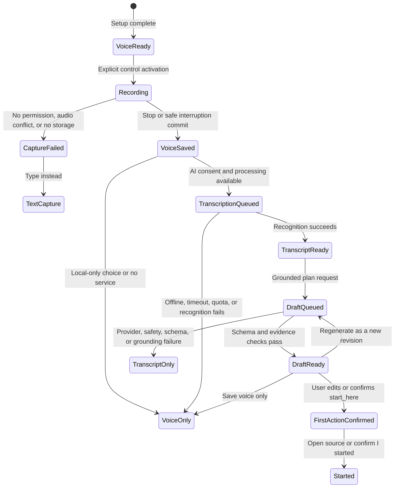
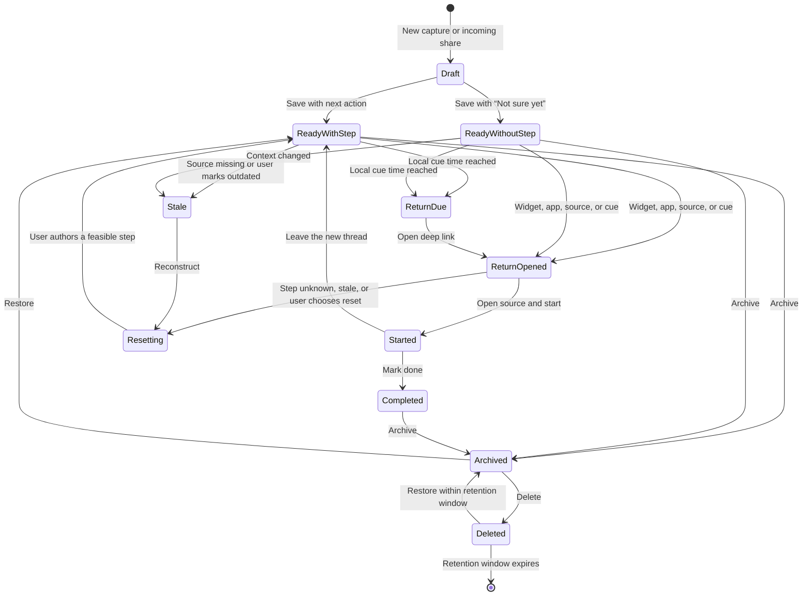

# Restart Thread UX blueprint

This blueprint now uses the controlling **A — Instant Voice Thread** revision.
The app saves a short voice note locally before AI drafts a grounded recovery
plan. Context + Voice is an alternate entry, and Voice Rescue is the fallback.
The complete revision and platform caveats are in
[voice-ai-revision.md](./voice-ai-revision.md). The original manual capture
specifications below remain valid text and accessibility fallbacks.

This is a design hypothesis for validation, not evidence that the concept
works. C13 Reset Button and C14 Breadcrumb remain the core; C15 Start Together
stays outside the MVP.

## Experience contract

Restart Thread makes one promise: **say where you are, then return to one clear
next action without reconstructing the whole plan.**

The critical experience must satisfy these constraints:

- A prepared voice capture starts in five seconds or less, stops in one action,
  and commits locally before processing. Text capture remains possible in 30
  seconds or less.
- The saved record contains the last known state, one source artifact when
  available, and either a next visible action or an honest `not sure yet` state.
- AI drafts one first action and at most three later steps. Every factual plan
  item points to transcript evidence; the user confirms or edits the first
  action before it becomes active.
- A return opens the selected voice thread or draft, not a dashboard or backlog.
- The app remains useful without notifications, an account, microphone
  permission, AI consent, a supported Lock Screen host, or a network.
- A missing source, stale step, denied permission, canceled purchase, or killed
  process has a visible recovery path.
- The app never diagnoses ADHD, chooses health or crisis priorities, silently
  activates an invented action, or uses shame, streak loss, urgency, or social
  pressure.

## Acquisition promise and store expectation

The revised Google Play short-description hypothesis is:

> Speak where you are. Return to one clear first step.

This is a positioning hypothesis, not validated copy. It avoids a clinical
claim and names the outcome rather than the feature. The first three store
screenshots should establish a single causal chain:

1. **Speak before the thread disappears** — one prepared voice control, a
   visible recording state, and immediate local save.
2. **Review a grounded recovery draft** — `You said`, one editable `Start here`
   action, transcript evidence, and visible assumptions.
3. **Use the first step** — the source and confirmed action remain together.

Optional later screenshots can show the widget, offline/local-first behavior,
and large-window layout. Use actual UI and truthful states. Do not claim
`zero-friction`, `never lose focus again`, ADHD treatment, cross-device sync, or
Galaxy optimization before each is shipped and tested.

The first-launch screen must fulfill the store promise within one interaction.
It offers **Try a voice example**, **Record my first thread**, and **Type
instead**. It does not request notification permission, require an account,
present a paywall, or ask the user to configure a productivity system.

After the sample demonstrates value, a separate setup explains microphone use,
requests permission, separates local recording from optional cloud processing,
and offers the appropriate Lock Screen, Action button, Side button, or home
widget setup. Skipping setup preserves the complete text and Share paths.

## Journey map

Success is a return to meaningful action, not an app open. Emotion labels are
analyst hypotheses to test in interviews and usability sessions.

| Stage | User goal | Actions | Likely question | Emotion hypothesis | Friction | Product opportunity | Observable success signal |
|---|---|---|---|---|---|---|---|
| Discover | Decide whether this is different from another to-do app | Sees listing, scans first screenshots, installs | “Will this help after interruption, or create another list?” | Skeptical, hopeful | Productivity-category fatigue; close substitutes | Show capture-to-return transformation in ten seconds | Qualified install; first screenshot comprehension without explanation |
| First launch | Understand the mechanism without setup | Reads promise; records a sample or chooses text | “Will speaking save work or create more cleanup?” | Cautious | Fear of another system; AI distrust | A disposable example shows voice, local save, grounded draft, edit, and start | Explains the product as “say where I am and get an editable first step” |
| Voice setup | Enable quick capture deliberately | Reviews local microphone use; grants or denies microphone; separately enables or rejects cloud drafting; adds an available quick surface | “What leaves my phone, and can I still use this if I say no?” | Alert, privacy-conscious | Two permissions/consents can feel like onboarding burden | Separate capture from processing and prove both decline paths | Correctly explains local audio, optional remote processing, deletion, and fallback |
| Instant capture | Preserve the messy state before it decays | Activates Lock Screen/control/widget/shortcut; speaks; stops | “Can I leave now?” | Interrupted, rushed | Public setting, speech accessibility, unavailable locked host | One start/stop action; generic locked UI; local save before processing | Starts in ≤5 s and obtains durable local save without help |
| AI processing | Turn the note into a bounded draft without blocking departure | Does nothing while transcription and drafting run | “Did it save if AI fails?” | Neutral or uncertain | Network, latency, provider error, speech accuracy | Show separate `saved`, `transcribing`, `drafting`, and `voice-only` states | Audio survives every failure; p75 draft target is measured, not assumed |
| Draft return | Re-enter the right context without exposing it on the lock screen | Opens generic **Draft ready** status after authentication | “Is this actually what I said?” | Hesitant, curious | Fluent but wrong summary; assumptions hidden | Show transcript evidence, confidence, and assumptions beside one first action | Identifies the draft as AI, locates evidence, and corrects it without help |
| Resume | Take the first meaningful action | Edits or confirms **Start here**; opens source or selects **I started** | “Is this safe and specific enough?” | Growing confidence | Missing source; reversed negation; overbroad plan | Confirm only the first action; keep later steps collapsed and editable | Starts within 60 s of opening a ready draft |
| Voice rescue | Recover when no breadcrumb exists | Speaks remembered state and blocker; AI labels uncertainty and asks nonblocking questions | “What can be recovered honestly?” | Frustrated, vulnerable | Weak evidence can create generic advice | Draft a hypothesis rather than pretending the old state is known | User corrects state and action without believing AI chose the priority |
| Update or close | Preserve the new state without list maintenance | Marks started/completed, leaves a new stopping point, archives, or abandons | “Do I have to tidy this up?” | Relief, fatigue | Completion flows often demand metadata | **Leave the new thread** reuses the capture sheet; archive is reversible | State is updated in under 20 seconds; no orphaned active record |
| Repeat | Make the mechanism available at the moment of need | Uses a prepared voice control, Share, text, or shortcut | “Can I do this before attention shifts?” | Familiar | Entry surface may be forgotten or unavailable on this device | Contextual entry surfaces, not daily streaks | Spontaneous voice or text threads occur without study prompts |
| Upgrade/manage | Pay only after recurring value is visible | Attempts fourth active thread or selects a Plus feature; purchases, restores, manages, cancels | “Will my saved work be held hostage?” | Deliberative, wary | Sensitive moment; subscription-value ambiguity | Existing data stays readable; clear terms; restore and manage paths | Purchase outcome is understood; cancellation and expiry preserve data |

## Information architecture

The architecture contains one primary destination, **Now**, and one supporting
collection, **All threads**. A bottom navigation bar is unnecessary for two
destinations and would compete with the primary action.

```text
Restart Thread
├── Now
│   ├── Current Return Card
│   │   ├── Open source and start
│   │   ├── Reset this step
│   │   ├── Edit thread
│   │   └── Complete / archive
│   ├── Recent threads
│   └── Record / type / share a thread
├── Quick voice capture
│   ├── Locked or unlocked idle control
│   ├── Recording timer and stop
│   ├── Durable local save
│   ├── Transcribing / drafting
│   └── Voice-only failure fallback
├── Capture surface
│   ├── Shared source preview
│   ├── Speak the state / type instead
│   ├── Where I stopped
│   ├── Next visible step / Not sure yet
│   ├── Optional return cue
│   └── Save locally
├── AI draft review
│   ├── You said / transcript
│   ├── Start here / evidence / confidence
│   ├── Then / collapsed steps
│   ├── Questions and assumptions
│   └── Use first step / Edit / Save voice only
├── Reset flow
│   ├── What still matters?
│   ├── What is blocking the next move?
│   └── What can you open, write, send, or decide in two minutes?
├── All threads
│   ├── Active
│   ├── Completed
│   ├── Archived
│   ├── Search
│   └── Recently deleted
└── Settings
    ├── Voice and Lock Screen setup
    ├── AI processing, provider, retention, and deletion
    ├── Return cues and quiet hours
    ├── Widget help
    ├── Accessibility and feedback
    ├── Data, export, and deletion
    ├── Upgrade / restore / manage plan
    └── Help and privacy
```

On compact widths, the collection and detail appear one at a time. On medium
and expanded widths, **All threads** becomes a list-detail layout: the list stays
visible beside the selected Return Card. Fold, unfold, rotation, multi-window,
and DeX changes must preserve the selected thread, field focus, draft text, and
scroll position. The layout responds to the current window, not a phone/tablet
device label.

## Screen inventory

| ID | Surface | Purpose | Primary action | Required states |
|---|---|---|---|---|
| S00 | Store page | Establish the capture-to-return promise | Install | Localized metadata; actual screenshots; preview captions |
| S01 | First launch | Explain value without setup | Try example / Leave my first thread | Fresh; returning; large text |
| S02 | Guided example | Demonstrate the mechanism with disposable content | Save example | In progress; skipped; completed |
| S03 | Capture editor | Commit a real breadcrumb | Save thread | Blank; prefilled share; draft restored; validation; source too large/unsupported |
| S04 | Save confirmation | Prove durability and preview future value | Done | Saved; cue offered; cue unavailable; local-only disclosure |
| S05 | Cue rationale | Explain the specific return cue | Notify me for this thread | Permission not asked; denied; granted; dismissed |
| S06 | System permission | Obtain OS consent | OS controlled | Allowed; denied; dismissed |
| S07 | Now — empty | Point forward without a dashboard | Leave a thread | First empty; all complete; offline |
| S08 | Now — active | Surface one selected thread and recent records | Return to thread | Active; stale; due; started; multiple recent |
| S09 | Share receiver | Accept source context from another app | Continue capture | Text; URL; image; PDF; unsupported; malicious/oversize input |
| S10 | Widget | Show current thread outside the app | Return / Leave a thread | Active; no thread; loading; unavailable; resized |
| S11 | Return Card | Restore context and start | Open source and start | Ready; source missing; step unknown; stale; offline; already completed |
| S12 | Reset — matter | Confirm the outcome that still matters | Continue | Prefilled; edited; blank |
| S13 | Reset — blocker | Name why the old step no longer works | Continue | Unclear; too big; missing input; low capacity; changed priority; other |
| S14 | Reset — action | Author one visible next action | Use this step | Draft; example help; invalid/vague; saved |
| S15 | Thread detail | Review or edit all thread data | Save changes | View; edit; source replaced; conflict-free local update |
| S16 | All threads | Find a noncurrent record | Open thread | Active; completed; archived; no results |
| S17 | Recently deleted | Recover accidental deletion | Restore | Available; expired; empty |
| S18 | Paywall | Explain Plus after a value boundary | Choose plan | Eligible; loading products; products unavailable; purchase canceled |
| S19 | Purchase outcome | Confirm the store result | Continue | Pending; success; canceled; failed; already owned |
| S20 | Restore purchases | User-triggered recovery | Restore | Idle; OS sign-in; success; no purchase; network/store error |
| S21 | Plan status | Manage entitlement without losing work | Manage plan | Active; cancel pending; billing retry/grace; expired; offline cache |
| S22 | Settings | Control cues, data, feedback, and plan | Contextual | Notification denied; widget not installed; export; delete |
| S23 | Error/recovery | Explain what happened and preserve work | Retry / Save without source | Source inaccessible; storage error; malformed share; stale deep link |
| S24 | Voice and AI setup | Explain local capture, request microphone, choose local or cloud processing, and add a quick surface | Enable voice capture | Permission unknown/granted/denied; local only; cloud consented/declined; surface supported/unsupported |
| S25 | Locked voice control | Start without exposing private content | Record a thread | Ready; setup required; storage locked after reboot; unsupported host |
| S26 | Locked recorder | Make recording and stop unmistakable | Stop recording | Starting; recording; 50-second warning; interrupted; microphone revoked; stopped |
| S27 | Voice saved / processing | Separate durable save from transcription and AI | Done / Open voice | Saved; transcribing; drafting; draft ready; offline queued; provider failed; voice only |
| S28 | AI draft review | Check evidence and confirm only the first action | Use this first step | Ready; low confidence; questions; assumptions; edited; regenerating; stale revision |
| S29 | Transcript and evidence | Inspect, correct, and trace the draft | Save transcript edits | Partial; complete; uncertain segment; on-device; remote; failed |
| S30 | AI privacy and deletion | Control audio, transcript, provider, retention, export, and deletion | Save choices / Delete data | Local only; remote enabled; queued upload; audio deleted; transcript retained; deletion failed |

## Core state transitions

The thread state and entitlement state are independent. A purchase failure must
never corrupt a thread, and notification status must never determine whether a
thread can be reopened.

### Voice and AI state

Audio durability and AI readiness are separate. `VoiceSaved` is a valid thread
even if every later transition fails.



`DraftReady` never overwrites transcript or audio. A draft with missing evidence,
reversed negation, invalid schema, or a disallowed high-stakes recommendation
goes to `TranscriptOnly` and explains the recovery path.



### State invariants

- `Recording` requires an explicit user start, a visible system microphone
  indicator, a visible elapsed time, and a stop action. It never begins from a
  passive notification or AI decision.
- `VoiceSaved` is committed locally before upload, transcription, drafting,
  notification, animation, or navigation. A failed processor can't remove it.
- Locked states contain only generic labels: `Record a thread`, `Recording`,
  `Voice thread saved`, `Drafting recovery`, or `Draft ready`.
- Every factual draft item includes transcript evidence IDs and confidence.
  `FirstActionConfirmed` requires a user edit or explicit confirmation.
- Regeneration creates a visible revision and preserves the accepted prior
  action. AI never schedules, contacts, or starts an external action by itself.
- `Draft` autosaves field text, selected source metadata, and navigation state.
- `ReadyWithStep` requires `where_stopped` and `next_visible_step`.
- `ReadyWithoutStep` requires `where_stopped` and an explicit `not_sure_yet`;
  an empty field is not silently treated as a choice.
- A cue is an attribute, not a status. Denying notifications does not alter the
  thread state.
- `Started` records an event only after the user activates **Open and start** or
  explicitly marks **I started**; an app open is not a start.
- `Stale` preserves the old state and source. Resetting creates a revision; it
  does not overwrite history invisibly.
- Archive and delete are reversible from persistent destinations. A temporary
  snackbar is a convenience, not the only undo path.

### Onboarding state

`NEW → VOICE_EXAMPLE → CORE_READY → MICROPHONE_SETUP_ELIGIBLE →
AI_PROCESSING_CHOICE → QUICK_SURFACE_SETUP → COMPLETE`.
The user can skip the example and move directly to text/Share `CORE_READY`.
Microphone setup follows an explicit voice action. Cloud AI consent is separate
from microphone permission and can be declined while preserving local voice.
Cue education becomes eligible only after a real thread has been saved and the
user elects to set a cue.

### Notification state

`NOT_ASKED → SOFT_EXPLAINED → GRANTED | DENIED | DISMISSED`.
After denial, the cue control explains that the thread remains available from
Now and the widget. Only an explicit later attempt to enable cues opens system
settings; the app does not repeatedly pressure the user.

### Entitlement state

`FREE → PURCHASE_PENDING → PLUS_ACTIVE → CANCEL_PENDING → EXPIRED → FREE_LIMITED`.
`BILLING_RETRY_OR_GRACE` branches from `PLUS_ACTIVE`; `RESTORE_PENDING` can lead
to `PLUS_ACTIVE`, `NO_PURCHASE_FOUND`, or `RESTORE_FAILED`. Cancellation remains
active through the paid period. On expiry, data remains readable and exportable;
the user selects up to three active threads before creating another.

## Critical-path interaction specification

### S24 — Voice and AI setup

Purpose: make future one-action capture possible without hiding permission or
cloud-processing consequences.

- Begin after a five-second voice example, not on first launch.
- Explain local microphone use before the system prompt: **Restart Thread uses
  your microphone only after you start a voice thread. It saves the recording
  locally first.**
- Actions: **Enable voice capture** and **Keep using text**.
- After permission, present a separate processing choice: **Use AI recovery
  drafts** or **Keep voice notes local**. Name any remote processor, what is
  transmitted, retention, deletion, and the deterministic fallback.
- Offer the supported quick surface for this device: **Add Lock Screen control**,
  **Add Lock Screen widget**, **Set Action button**, **Set Side button**, or
  **Add home widget**. Do not show unavailable surfaces as disabled promises.
- Run a device check and record the proven capability. If locked start fails,
  configure the unlocked fallback instead of telling the user to troubleshoot.

### S25/S26 — Locked control and recorder

Purpose: capture a messy state with one deliberate start and one stop while
revealing no private content.

- Idle label: **Record a thread**. Starting requires one user activation; it
  never follows notification delivery or wake automatically.
- Recording label: **Stop recording**, with elapsed time, system microphone
  indicator, optional haptic, and no transcript or waveform-only feedback.
- Prototype limit: 60 seconds. At 50 seconds, announce **10 seconds left**
  visually, through a polite accessibility status, and with an optional haptic.
- Interruption by call, another recorder, permission revocation, storage error,
  or process death commits completed audio frames when possible and reports a
  generic recovery state.
- If microphone setup is incomplete or protected storage is unavailable after
  reboot, request authentication and open the exact setup/recovery screen.

### S27 — Voice saved and processing

Purpose: separate the trustworthy local outcome from optional AI work.

- First status: **Voice thread saved**. This appears only after durable local
  commit.
- Later generic states: **Transcribing**, **Drafting recovery**, **Draft ready**,
  **Waiting for connection**, and **Voice saved—draft unavailable**.
- The user can leave immediately after save. Processing may continue only under
  the user's prior consent and platform background rules.
- No task, transcript, source, or plan text appears while locked. Opening a
  ready draft requires normal platform authentication when the device is secure.

### S28/S29 — AI draft review and evidence

Purpose: turn the note into one low-load start without disguising AI uncertainty.

- Persistent label: **AI draft—check before using**.
- Section 1: **You said**, two lines, with **View transcript**.
- Section 2: **Start here**, one editable verb-led action, confidence, and a
  **Why this?** disclosure that highlights transcript segments.
- Section 3: **Then**, up to three collapsed steps.
- Section 4: **Needs your answer**, no more than two nonblocking questions, then
  **Assumptions** when present.
- Primary action: **Use this first step**. Secondary: **Edit draft** and **Save
  voice only**. Regenerate is tertiary and creates a revision.
- If grounding validation fails, show transcript plus **Write the first step**;
  never show an uncited fluent fallback.

### S01 — First launch

Purpose: establish the mechanism and produce a useful action before setup.

- Title: **Say where you are. Start again from one clear step.**
- Body: **Record a quick voice thread. Restart Thread saves it first, then drafts
  a small recovery plan you can check.**
- Primary action: **Record my first thread**.
- Secondary actions: **Try a voice example** and **Type instead**.
- Tertiary text link: **How your data stays local**.
- Do not show account creation, categories, notification permission, an ADHD
  questionnaire, pricing, or a carousel.
- Back exits normally. The app preserves no personal data until the user enters
  a capture.

### S03/S09 — Capture editor

Purpose: save the smallest state future the user needs.

- If launched from Android Sharesheet, validate the MIME type and prefill a
  source chip with origin, title, and safe preview. Never execute or upload
  incoming data automatically.
- Top title: **Leave a thread**. Supporting line: **Speak the state now, or type
  what future you will need.**
- Primary capture choice: **Speak the state**. It uses the same local-first voice
  state as S25/S26. **Type instead** exposes the original fields without hiding
  the source.
- Field 1, required: **Where I stopped**. Example help: **“Compared the two plans;
  the annual option looks cheaper after month eight.”**
- Field 2: **Next visible step**. Example help: **“Open the pricing sheet and
  verify the cancellation fee.”**
- Explicit alternative below field 2: **I’m not sure yet**. Choosing it creates
  a valid `ReadyWithoutStep` state.
- Source row: editable preview with **Replace** and **Remove**. The screen never
  implies that a source will remain accessible if the originating app revokes
  access.
- Optional collapsed row: **Add a return cue**. No permission request occurs
  until the user selects a cue and saves.
- Primary action in text mode: **Save thread**. Voice mode uses **Stop
  recording**, then commits automatically. Both remain available above the
  keyboard and system gesture inset.
- Secondary: **Discard draft**, with confirmation only when meaningful input
  exists. Normal back preserves the draft and announces it.
- Save writes locally before animation. On storage failure, keep all field text
  and offer **Try again** and **Copy text**.

### S04 — Save confirmation

Purpose: prove the value and let the interrupted user leave.

- Announce **Thread saved** to TalkBack/VoiceOver after durable commit.
- Show a compact preview of the future Return Card: source, last state, and next
  step or **Find one next step**.
- Primary action: **Done**.
- If a cue was selected and permission is not decided, offer one contextual
  explanation: **Allow return cues? Restart Thread will notify only at times you
  choose. Your thread stays available if you say no.**
- Actions: **Continue without cues** and **Allow cues**. The former is equally
  visible and never disables the core.
- Do not offer a paywall, widget setup, streak, confetti, rating prompt, or
  social share during the first save.

### S08 — Now

Purpose: reveal one current thread with minimal decision load.

- Page title: **Now**.
- The first card is the current Return Card. It contains the thread name,
  source, one last-state sentence, and one next-action sentence.
- Primary action: **Return to thread**.
- Secondary actions: **Leave a thread** and **All threads**. Settings remains in
  the top app bar.
- Recent threads show at most three compact rows. No due-count badge, streak,
  productivity score, or overdue red wall.
- If empty, title **Nothing is waiting here**; body **Leave a thread before you
  switch away, or try the example.** Primary **Leave a thread**.
- If offline, show no global error because the core is local. Network-dependent
  purchase or future sync controls explain their own unavailable state.

### S10 — Android widget

Purpose: make the current return path available outside the app.

- Minimum useful size shows the current thread title and **Return**.
- Larger sizes add the one next action and **Leave a thread**.
- Empty state: **No active thread** plus **Leave one**.
- Loading state reserves the final layout and uses a labeled progress state; it
  does not flash an empty thread.
- Every action opens the exact destination. Updating or completing a thread
  updates the widget promptly.
- Interactive elements meet the 48 dp Android target and do not depend on color.

### S11 — Return Card

Purpose: restore context and cross the threshold to meaningful action.

- Title uses the thread name. The next element is a source chip or explicit
  **Source unavailable** state.
- Section 1: **You were here** with the saved last-state sentence.
- Section 2: **Next visible step** with exactly one action.
- Primary action: **Open source and start** when a source exists; **Start this
  step** when no source is needed.
- Secondary action: **Reset this step**.
- Tertiary overflow: edit, complete, archive, delete.
- Activation records `return_opened`. Opening the source records `started` only
  if the external handoff succeeds or the user confirms **I started** after
  returning. Avoid claiming behavioral success from the deep-link tap alone.
- Haptic feedback may confirm start but never replaces the visible and spoken
  state.

### S12–S14 — Reset flow

Purpose: recover from an absent or stale step without becoming a planner.

Each screen contains one question, progress text such as **1 of 3**, a back
action that preserves answers, and **Continue**. The final action is **Use this
step**.

1. **What still matters here?** Prefill the saved state and let the user edit
   it. Do not ask for a goal hierarchy.
2. **What is blocking the next move?** Options: **It’s unclear**, **It’s too
   big**, **I’m missing something**, **My capacity changed**, **The priority
   changed**, and **Something else**. This label is private context; the app
   does not infer a condition.
3. **What can you open, write, send, or decide in two minutes?** The user authors
   the step. Suggestions are examples of verbs, not generated advice.

The result screen collapses the old step into a subdued revision row and
promotes the new step. **Undo reset** remains available in thread history.

### S18–S21 — Paywall, purchase, restore, cancel, and expiry

Purpose: fund recurring value without holding interruption context hostage.

- No paywall appears on first launch, first save, or a return to an existing
  thread.
- The first natural trigger is an attempt to create a fourth active thread or
  to use a clearly labeled Plus capability.
- Free hypothesis: three active threads, local voice/text capture and playback,
  deterministic recovery, a small grounded-AI draft allowance, one cue per
  thread, widget, archive, export, deletion, and recovery.
- Plus hypothesis: more grounded drafts, unlimited active/history, multiple
  configurable cues, and later encrypted sync only after it exists. Do not
  promise AI volume, sync, provider retention, or latency in store assets before
  each is shipped and measured.
- Paywall title: **Keep more threads ready**. The user sees the active-thread
  limit, included Plus value, localized full price, period, renewal terms, and
  a visible close action.
- Actions: **Choose yearly**, **Choose monthly**, **Restore purchases**, and
  **Keep using free**. A lifetime local-only product remains a testable
  alternative if recurring value does not clear validation.
- Purchase pending prevents duplicate taps but permits cancellation through the
  store sheet. Canceling returns to the intact draft.
- Success: **Plus is active** and return to the exact interrupted action.
- Failure: direct explanation plus **Try again**, **Use free**, and **Restore**
  when applicable. Never use `Oops` or imply fault.
- Restore is always user-triggered and available in paywall and settings.
- Cancellation: entitlement remains active until the shown date; provide the
  system plan-management route without an exit-offer interception.
- Billing retry/grace: **Your threads are safe. Update payment to keep Plus
  features after [date].**
- Expired: all records remain readable and exportable. Ask the user to choose
  three active threads; the rest become read-only history until renewal or
  archive.

### S23 — Error and recovery patterns

Errors use a stable three-part structure: what happened, what was preserved,
and the next safe action.

| Condition | Message | Primary recovery | Secondary recovery |
|---|---|---|---|
| Source permission expired | **The source can’t be opened. Your saved context is still here.** | Replace source | Start without source |
| Unsupported share | **Restart Thread can’t use this item yet. You can still save its title or link.** | Save text only | Cancel |
| Oversize input | **This file is too large to attach. The link and your notes can still be saved.** | Continue without file | Choose another source |
| Local write failed | **The thread wasn’t saved. Your draft is still on this screen.** | Try again | Copy text |
| Stale deep link | **That thread moved to history.** | Open in history | Go to Now |
| Purchase unavailable | **Plans aren’t available from the store right now. Your thread is unchanged.** | Try later | Use free |
| Notification denied | **Return cues are off. Your threads remain available in Now and the widget.** | Continue | Open settings later |

## Predicted attention and interaction maps

These are **hypotheses**, not eye-tracking, click-tracking, or usability-study
results. Each must be checked with observation.

### S25/S26 locked voice capture — hypothesis

- Likely first fixation: the microphone symbol and **Record a thread** or the
  elapsed recording time.
- Scan order: control label → recording indicator/time → **Stop recording** →
  generic save status.
- Thumb reach: system placement varies; the entire control target must meet the
  host's touch requirements and not depend on a precise swipe.
- Primary action: start when idle, stop when recording. No second product action
  competes with it.
- Decision density: one action. Setup, source selection, plan content, and AI
  options never appear on the locked surface.
- Possible attention conflict: a waveform can dominate without communicating
  duration, privacy, or whether audio is safely saved.

### S28 AI draft review — hypothesis

- Likely first fixation: **Start here**, followed by the persistent **AI
  draft—check before using** label.
- Scan order: draft status → start action → confidence/evidence → primary action
  → later steps → questions and assumptions.
- Thumb reach: **Use this first step** anchors above the safe area; **Edit draft**
  is adjacent and equally discoverable but secondary.
- Primary action: **Use this first step**. Secondary: **Edit draft**. Tertiary:
  **Save voice only** and regenerate.
- Decision density: one first-action decision; later steps stay collapsed.
- Possible attention conflict: polished AI prose can overpower evidence and
  uncertainty. Keep summary short and put **Why this?** beside the action.

### S01 first launch — hypothesis

- Likely first fixation: the title **Pick up where you stopped**.
- Scan order: title → two-sentence mechanism → primary action → example action
  → local-data link.
- Thumb reach: primary sits in the lower-middle safe area; the privacy link can
  remain lower priority without shrinking below the target size.
- Primary action: **Leave my first thread**. Secondary: **Try a 20-second
  example**.
- Decision density: two meaningful choices. Risk rises if platform badges,
  feature chips, awards, or pricing appear here.
- Possible attention conflict: an illustration that depicts planning rather
  than interruption may teach the wrong category.

### S03 capture editor — hypothesis

- Likely first fixation: the prefilled source chip when entered from Share;
  otherwise **Where I stopped**.
- Scan order: source → last state → next step → optional cue → Save.
- Thumb reach: Save remains above the keyboard and navigation/gesture inset;
  replace/remove source actions are secondary and farther from the resting zone.
- Primary action: **Save thread**. Secondary: **I’m not sure yet** or return cue.
- Decision density: two required concepts, one optional cue. Risk rises if tags,
  projects, priority, duration, energy, and color appear at capture time.
- Possible attention conflict: a large attachment preview could dominate the
  text the user must author; use a compact, labeled preview.

### S04 save confirmation — hypothesis

- Likely first fixation: **Thread saved** and the Return Card preview.
- Scan order: confirmation → state/next step preview → Done → cue rationale when
  relevant.
- Thumb reach: **Done** is primary and easy to reach. Permission education is
  below the proof, not above it.
- Primary action: **Done**. Secondary: **Allow cues** only after cue selection.
- Decision density: one required exit plus one optional permission decision.
- Possible attention conflict: animation, confetti, rating, widget upsell, or a
  paywall would obstruct the urgent need to leave.

### S08 Now — hypothesis

- Likely first fixation: the current thread title and `Next visible step`.
- Scan order: current thread → primary return action → recent threads → capture
  action → All threads.
- Thumb reach: **Return to thread** and **Leave a thread** sit in the lower half;
  Settings remains top-right because it is not part of the loop.
- Primary action: **Return to thread**. Secondary: **Leave a thread**.
- Decision density: one current choice plus at most three recent alternatives.
- Possible attention conflict: counts, dates, overdue styling, streaks, or
  analytics would turn Now into another backlog.

### S10 widget — hypothesis

- Likely first fixation: the next-action text, then the thread title.
- Scan order: next action → Return → optional Leave a thread.
- Thumb reach: launcher position varies, so every target must be independent and
  at least 48 dp; no edge-only gestures.
- Primary action: **Return**. Secondary: **Leave a thread** on larger sizes.
- Decision density: one or two actions.
- Possible attention conflict: showing multiple threads at small sizes makes the
  widget a miniature task manager and weakens glanceability.

### S11 Return Card — hypothesis

- Likely first fixation: **Next visible step**, provided typography makes it
  more prominent than historical context.
- Scan order: source identity → `You were here` → next step → **Open and start**
  → reset.
- Thumb reach: the primary start action anchors above the bottom safe area;
  reset is adjacent but visually subordinate.
- Primary action: **Open source and start**. Secondary: **Reset this step**.
- Decision density: act or repair. Management actions live in overflow.
- Possible attention conflict: a large timer, motivational quote, task history,
  or gamified status can displace the saved cue.

### S12–S14 Reset — hypothesis

- Likely first fixation: the single question on each screen.
- Scan order: question → saved context or response options → answer → Continue.
- Thumb reach: options and Continue are large, vertically spaced, and clear of
  the keyboard and system gesture regions.
- Primary action: **Continue**, then **Use this step**. Secondary: Back.
- Decision density: one decision per screen; six blocker options are the highest
  density point and need testing.
- Possible attention conflict: friendly mascots, praise, or playful error copy
  may feel patronizing during frustration; keep the tone calm and direct.

### S18 paywall — hypothesis

- Likely first fixation: the concrete Plus boundary **Keep more threads ready**,
  followed by the price.
- Scan order: benefit → comparison → localized price/term → chosen plan → restore
  and free exit.
- Thumb reach: plan purchase and **Keep using free** are reachable; close and
  restore remain visible and correctly labeled.
- Primary action: selected purchase. Secondary: **Keep using free**. Tertiary:
  **Restore purchases**.
- Decision density: two plan choices plus the free exit. Risk rises with fake
  scarcity, countdowns, preselected trials, or hidden renewal terms.
- Possible attention conflict: annual savings emphasis can obscure total price;
  both total and equivalent interval must remain legible.

### S23 error/recovery — hypothesis

- Likely first fixation: the plain-language problem statement.
- Scan order: what happened → confirmation that the draft/thread is safe →
  primary recovery → alternate recovery.
- Thumb reach: the safest recovery is the bottom primary action; destructive
  actions do not share its emphasis or location.
- Primary action: context-specific recovery. Secondary: safe bypass or copy.
- Decision density: two recovery choices at most.
- Possible attention conflict: error codes, generic illustrations, or transient
  snackbars can hide the next safe step.

## Visual hierarchy before visual styling

This run selects hierarchy, not a final color, typeface, illustration, or motion
direction.

- The `Next visible step` is the strongest text on Return Card; `You were here`
  is supporting evidence, not the hero.
- Source identity is a compact, recognizable chip rather than a large media
  preview.
- One filled primary action per view. Secondary actions use lower emphasis, and
  destructive actions remain in an overflow or confirmed detail view.
- Groups are separated first by spacing and headings, not by stacking cards
  inside cards.
- Align field labels, text, chips, and actions to a shared reading edge.
- Use progressive disclosure for cue settings, source replacement, history, and
  purchase management.
- Compact windows remain one column. Expanded windows add a list-detail pane;
  they do not stretch a phone form across the display.
- Motion may show state continuity—capture compressing into the Return Card or
  a stale step becoming history—but it cannot delay saving, navigation, or
  accessibility focus.

## UX writing system

Use `thread` for the saved interruption record throughout the UI. Do not switch
among breadcrumb, checkpoint, task, session, and plan in user-facing copy.
`Breadcrumb` remains an internal research term.

### Voice and grammar

- Calm, specific, nonclinical, and nonjudgmental.
- Sentence case for headings and controls.
- Verb-first buttons: **Save thread**, **Open source and start**, **Reset this
  step**, **Restore purchases**.
- Prefer what happened and what the user can do next over apology or personality.
- Never use `failed`, `lazy`, `behind`, `streak`, `should`, `just focus`, or
  `Oops` in recovery copy.
- Do not promise that the app knows the right priority. The user authors or
  confirms every next step.
- Keep labels persistent; examples supplement labels and never replace them.

### Copy inventory

| Context | Recommended copy | Avoid |
|---|---|---|
| Product promise | **Say where you are. Start again from one clear step.** | “Beat ADHD procrastination forever” |
| Locked voice idle | **Record a thread** | “AI recovery” |
| Locked voice recording | **Stop recording** | An icon or waveform without a label |
| Durable voice save | **Voice thread saved** | “AI plan created” before processing succeeds |
| AI processing | **Drafting recovery** | “Thinking…” |
| Draft disclosure | **AI draft—check before using** | “Your recovery plan” |
| Draft evidence | **Why this?** | “AI reasoning” |
| Draft primary action | **Use this first step** | “Accept plan” |
| Capture title | **Leave a thread** | “Create task” |
| State field | **Where I stopped** | “Context” |
| Action field | **Next visible step** | “Objective” |
| Unknown action | **I’m not sure yet** | Blank acceptance or “Skip” |
| Save success | **Thread saved** | “Awesome! You crushed it!” |
| Return context | **You were here** | “Previously…” |
| Resume | **Open source and start** | “Resume workflow” |
| Reset | **Reset this step** | “Fix your plan” |
| Empty state | **Nothing is waiting here** | “No data” |
| Source error | **The source can’t be opened. Your saved context is still here.** | “Error 403” |
| Permission rationale | **Notify only at times you choose. Your thread stays available if you say no.** | “Enable notifications for the best experience” |
| Expiry | **Your threads are safe. Choose three to keep active.** | “Upgrade to unlock your data” |

## Nudge inventory and dark-pattern audit

| Nudge | User benefit | Trigger and timing | Suppression rule | Dark-pattern check |
|---|---|---|---|---|
| Generic draft-ready status | Tells the user optional processing finished without exposing the task | After a locally saved voice thread reaches `DraftReady` | One status per voice thread; no repeat for nonresponse | Says only **Draft ready**; no transcript, source, task, plan, urgency, or badge escalation |
| Quick-surface setup | Makes later capture possible in one action | After a successful in-app voice example and microphone grant | Show once per device; remain available in Settings | Skip preserves text, Share, and in-app voice; never imply universal Lock Screen support |
| Notification soft prompt | Makes an explicitly chosen return cue possible | After first real save, only when the user selects a cue | Stop after denial/dismissal; show again only after a later explicit cue action | Equal **Continue without cues**; no first-launch prompt or disabled core |
| Scheduled return cue | Surfaces the exact saved thread | At the user-selected local time | One cue occurrence; no repeated reminder for nonresponse; quiet hours respected | No urgency, shame, private source text, or badge escalation |
| Widget suggestion | Reduces later entry friction | After two successful real captures or from Settings | Show once; never modal-block capture or return | No claim that widget is required; provide manual setup help |
| Stale-thread in-app flag | Prevents following an outdated step | When user opens a thread older than a tested threshold or source fails | In-app only; dismiss per thread; no push based solely on age | Uses **Check this step**, not overdue or failure language |
| Active-thread limit | Explains paid boundary at the moment it matters | User attempts a fourth active thread | Dismiss for seven days unless the user retriggers the boundary | Preserve draft; offer archive and free use; no fake scarcity |
| Plus feature education | Explains recurring value | User taps a clearly labeled Plus control | Do not repeat for the same control after dismissal during session | No disabled-looking free core or surprise checkout |
| Billing-status banner | Protects continuity before Plus expires | Store reports grace/retry or cancellation date | Persistent but nonmodal; clear after resolution/expiry | Says data is safe; no countdown animation or cancellation obstruction |
| Return outcome check | Separates app opens from meaningful starts | After user returns from the external source or next app launch | Ask once; allow dismiss; do not notify | **Did you start this step?** with Yes / Not yet; no praise or blame |

No streaks, daily nagging, red overdue counts, social comparison, random rewards,
loss aversion, escalating push frequency, exit-intercept offers, or C15 invitation
appear in the recommended MVP.

## Accessibility requirements

These requirements come from Android and Apple platform guidance, WCAG 2.2,
and the installed accessibility skill. They are acceptance criteria, not polish.

### Voice and locked-surface access

- Voice is an accelerator, not the only input. **Type instead**, Share, and
  deterministic reset have equal semantic status and remain available after
  microphone denial or speech-recognition failure.
- The locked control exposes a clear accessible name and state: **Record a
  thread**, **Recording, 12 seconds**, **10 seconds left**, **Voice thread
  saved**, and **Draft ready**.
- Do not use a waveform as the only recording feedback. Pair the system
  microphone indicator with elapsed text, state label, optional haptic, and a
  labeled stop control.
- Do not require speech to stop recording. The same control toggles start/stop;
  an optional hardware-button path is additive.
- Preserve recordings during calls, audio-route changes, Bluetooth changes,
  screen-off, switch access, and screen-reader use. Announce interruption and
  whether audio was saved.
- Test users with speech differences and recognition errors. Transcript edits
  use normal text controls and preserve the audio evidence.
- AI confidence never relies on color. Evidence links have clear names such as
  **Show transcript evidence for Start here**.

### Text and reflow

- Support Android system font scaling and Apple Dynamic Type through at least
  200% text enlargement.
- Avoid fixed-height text containers. At large sizes, horizontal field/action
  rows become vertical and long source titles wrap or truncate with an
  accessible full label.
- Reflow to the available width without two-dimensional reading or hidden Save
  actions. Test compact-height landscape as well as narrow split-screen.
- Preserve a logical reading order when list-detail collapses to one pane.

### Contrast and color independence

- Normal text meets 4.5:1 contrast; large text and essential control boundaries
  meet at least 3:1.
- Ready, stale, started, completed, purchase, and error states include text and
  an icon or shape; color never carries the state alone.
- Focus indicators, field errors, selected options, and disabled controls remain
  distinguishable in light, dark, high-contrast, grayscale, and color-vision
  deficiency checks.

### Targets and reach

- Android interactive targets are at least 48 × 48 dp; Apple targets are at
  least 44 × 44 pt. The WCAG target floor does not justify smaller mobile
  controls.
- Keep primary capture and resume actions in a reachable lower-middle area,
  above keyboard, navigation, safe-area, and predictive-back gesture insets.
- Do not require a precise swipe. Every gesture has a labeled control
  equivalent.

### TalkBack, VoiceOver, and switch access

- Use native semantic controls. Every icon button has a purpose label, and
  dynamic controls expose selected, expanded, disabled, loading, error, and
  current-thread states.
- Announce durable outcomes such as **Thread saved**, **Source unavailable**,
  **Purchase restored**, and **Draft preserved** without stealing focus.
- Each thread row has a unique accessible name that includes its title and
  current state. Avoid dozens of identical **Open** buttons in the reading
  order.
- Group source metadata as one coherent element. Decorative imagery is hidden
  from assistive technology.
- On validation failure, move focus to the first invalid field and connect the
  error text programmatically. Do not clear valid fields.
- Test capture, return, reset, archive/restore, paywall close, and purchase
  restore with TalkBack, VoiceOver, Switch Access, and Voice Control where
  available.

### Keyboard, back, and external displays

- Tab order follows visual order. Enter/Space activate focused controls.
  Ctrl/Cmd+Enter saves from multiline fields; Escape closes a non-destructive
  sheet or moves back after preserving the draft.
- Android system Back and predictive back preview the real destination. A
  canceled gesture changes nothing.
- Hardware keyboard operation is complete on tablets, DeX, and the compatible
  Apple-silicon Mac build. Hover is never required.

### Motion, haptics, and sound

- Respect Reduce Motion and Android animator-duration settings. Replace spatial
  compression, parallax, or zoom with a short opacity change or an immediate
  transition.
- Focus never follows an animated element unpredictably. Saving does not wait
  for motion to finish.
- A light haptic may supplement save/start success. Haptics are optional,
  system-respecting, and never the only feedback.
- Sound is off by default and never signals success or error alone. Any demo
  video has captions and communicates the same proof without audio.

### Cognitive and language access

- One question or one primary decision per reset screen.
- Persistent labels, short paragraphs, plain verbs, and examples beside—not
  inside—fields.
- No timed reading, disappearing error, forced celebration, or punishment for
  inactivity.
- The user can save **I’m not sure yet** without fabricating a next step.
- Permission denial, purchase cancellation, and incomplete reset all preserve
  a usable core path.

## Instrumentation contract

Analytics must be opt-in or disclosed consistently with the final privacy
model. Never send captured source content, notes, attachment names, or task
titles as event properties.

| Event | Minimum safe properties | Product question |
|---|---|---|
| `voice_capture_requested` | surface; locked boolean; setup state; device-capability bucket | Can the prepared quick surface start where promised? |
| `voice_recording_started/stopped` | startup-latency bucket; duration bucket; interruption category | Is voice materially faster and reliable? |
| `voice_committed` | commit-latency bucket; encrypted-storage result; recovered-after-process-death boolean | Is audio durable before processing? |
| `transcription_outcome` | on-device/remote; language; latency bucket; result category | Which recognition path works without logging speech? |
| `ai_draft_outcome` | model/version alias; latency bucket; schema result; grounding coverage bucket; cost bucket | Is the draft fast, bounded, and grounded? |
| `ai_first_action_edited` | edit-distance bucket; reason category; time-to-correct bucket | Does AI remove work or create correction work? |
| `ai_draft_discarded` | reason category; voice-only retained boolean | Why is the draft not trusted? |
| `capture_started` | entry surface; content type category | Which surface meets interruptions? |
| `capture_committed` | elapsed bucket; has source; has next step; draft restored | Can users leave a useful thread quickly? |
| `capture_abandoned` | elapsed bucket; field reached | Where does capture become work? |
| `return_opened` | entry surface; thread age bucket; source available | Which return surface is used? |
| `source_open_attempted` | source type; result | Does the artifact handoff work? |
| `meaningful_start_confirmed` | elapsed-from-return bucket | Does the breadcrumb lead to action within two minutes? |
| `reset_started/completed` | reason category; elapsed bucket | Which stale states need repair? |
| `cue_permission_result` | trigger context; result | Does just-in-time rationale preserve choice? |
| `cue_opened` | delay bucket; deep-link success | Is the cue useful rather than merely delivered? |
| `paywall_viewed/outcome` | trigger; package; close/purchase/restore/error | Is the value boundary understood? |
| `accessibility_mode_observed` | large-text bucket; screen-reader boolean when safely available | Are critical flows exercised under adaptive needs? |

The primary behavioral metric remains the Run 6 denominator, revised for voice:
genuine saved voice or text threads that are reopened and followed by a first
meaningful action within two minutes. `Recording started`, `audio saved`, `AI
drafted`, `notification delivered`, `app opened`, and `source link tapped` are
intermediate events, not success.

## Skill-derived conclusions

- The UX research skill drove recent-incident interview framing, observable
  behavioral thresholds, the separate locked-capture and AI-grounding gates,
  and the rule that opinion or preference is not validation.
- The accessibility skill drove native semantics, persistent labels and errors,
  48 dp/44 pt targets, screen-reader announcements, scalable reflow, reduced
  motion, keyboard/switch access, equivalent nonspeech input, non-waveform
  recording feedback, and color-independent states.
- The layout skill drove one primary action per view, shared alignment edges,
  spacing-based grouping, progressive disclosure, window-based breakpoints,
  safe-area treatment, and the compact-to-list-detail adaptation.
- The UX-writing skill drove sentence case, verb-first actions, one consistent
  term (`thread`), direct recovery language, nonshaming tone, and forward-moving
  empty states. It also drove the persistent **AI draft—check before using**
  label and the distinction between **Voice thread saved** and later AI states.
