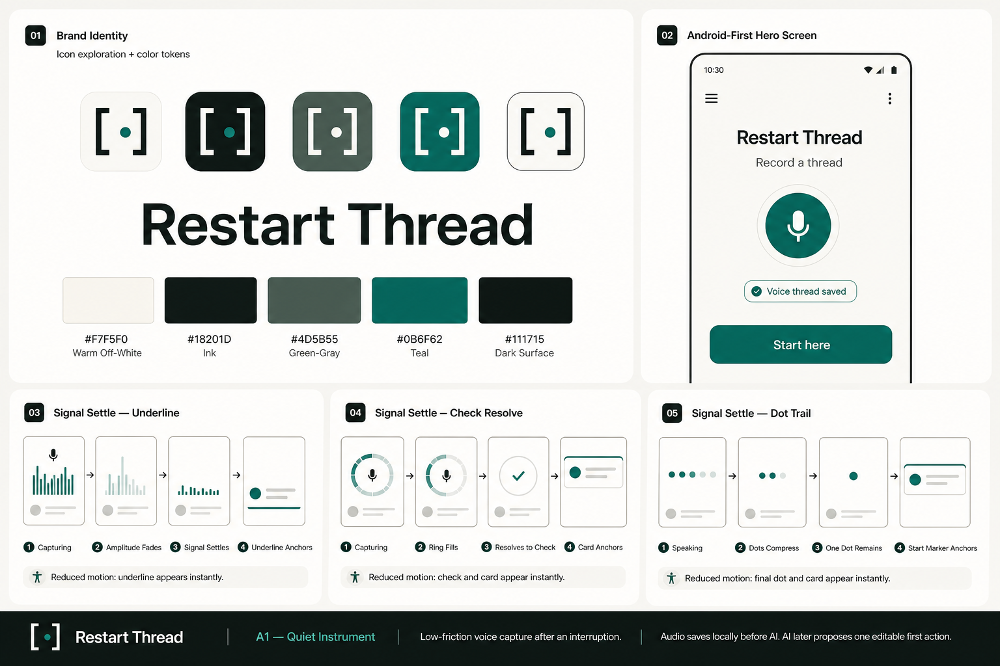
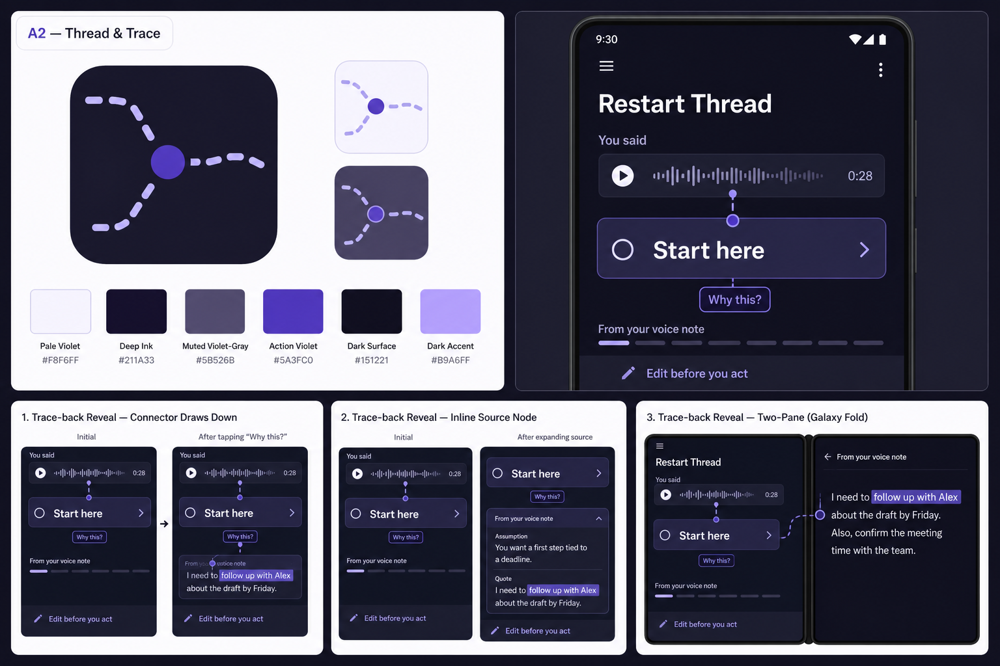
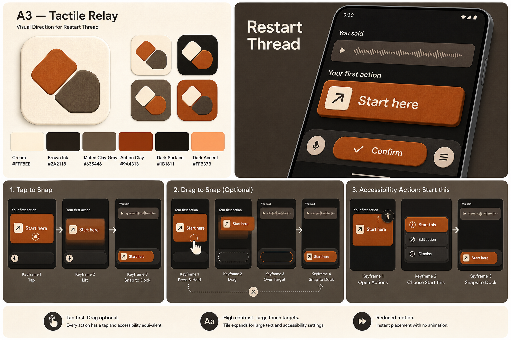
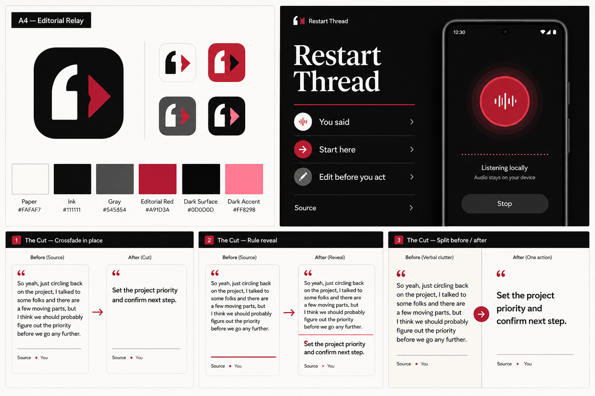
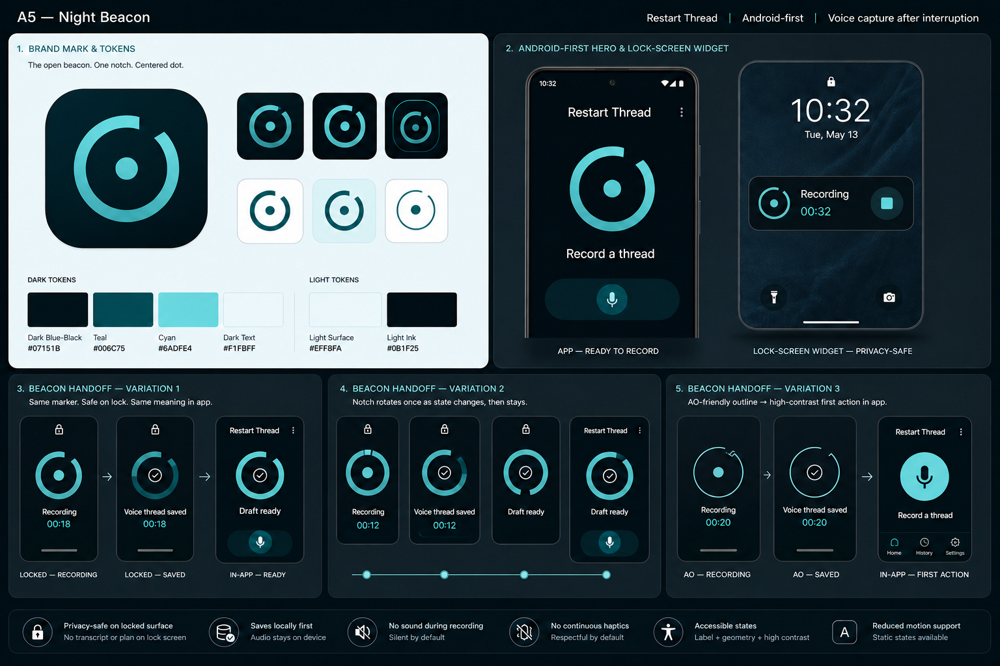
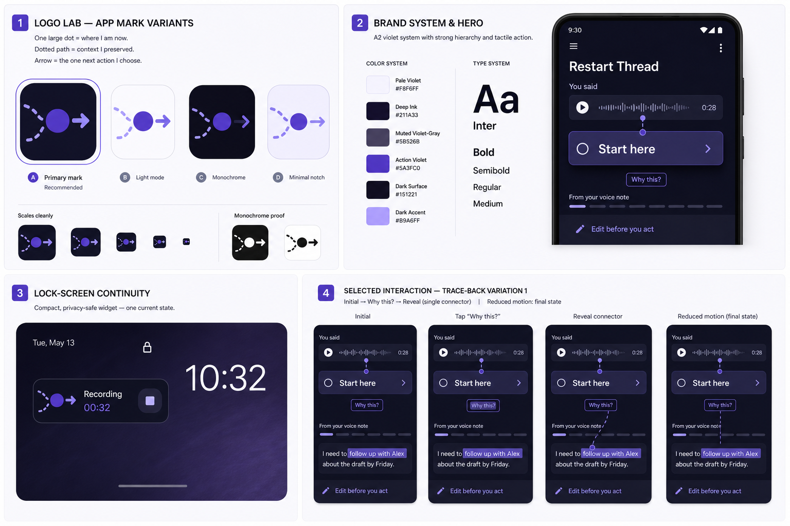
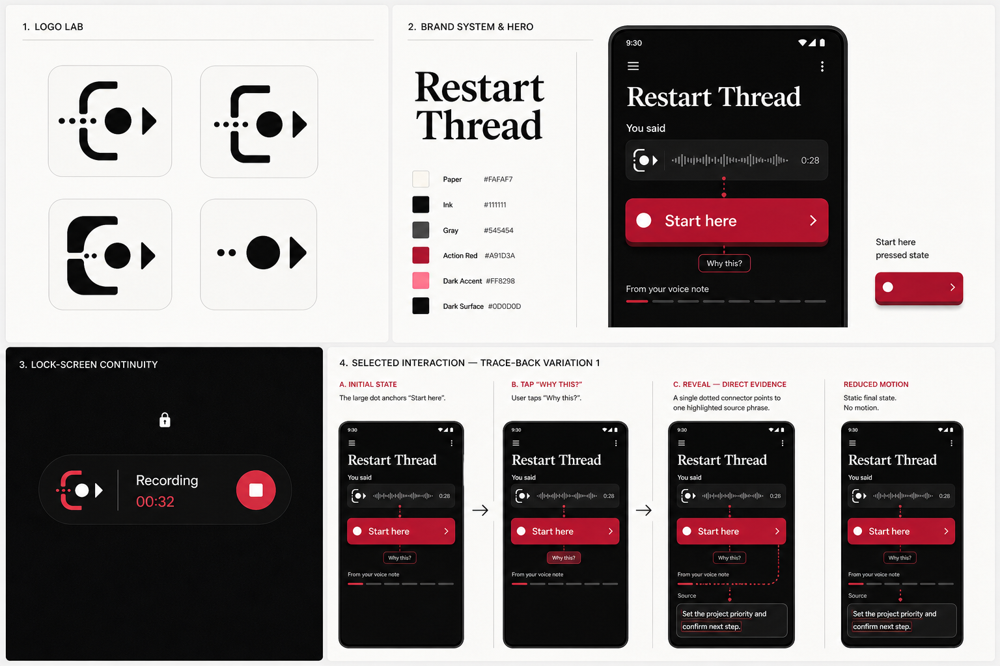

# Run 8 visual previews

These generated boards make the five Run 8 directions comparable. Each board
contains two brand, color, or typography views and three static storyboard
variations of its signature interaction. They are visual hypotheses, not final
screens, production assets, usability evidence, or physical-device proof.

## A1 — Quiet Instrument

The board tests the bracket-and-dot mark, warm neutral and teal palette, calm
system typography, and three Signal Settle variants: underline, check resolve,
and compressed dot trail. It is the clearest low-arousal direction, but its
brand may need more distinctiveness after the interaction is validated.

## A2 — Thread & Trace

The board tests the broken-route mark, violet evidence system, strong action
hierarchy, and three Trace-back Reveal variants: direct connector, inline
source node, and Galaxy two-pane evidence. It remains the recommended direction
because its signature behavior makes grounded AI observable. Production work
must simplify the connector when large text or localization creates crowding.

## A3 — Tactile Relay

The board tests offset pieces, warm clay surfaces, large verb-first type, and
three First Tile Snap variants: tap, optional drag, and accessibility action.
The generated material depth is intentionally exaggerated for comparison. A
production prototype should flatten the surfaces enough to avoid looking like
a game, toy, or kanban board.

## A4 — Editorial Relay

The board tests the quote-and-forward mark, paper, ink, and editorial-red
palette, serif display with system-sans controls, and three The Cut variants:
crossfade in place, rule reveal, and split before-and-after. Its static store
presentation is strongest, but the production capture treatment should remove
decorative glow and keep the editorial system subordinate to recovery speed.

## A5 — Night Beacon

The corrected board tests the open-beacon mark, dark and light tokens,
high-legibility locked presentation, and three Beacon Handoff variants: shared
marker, one-time notch transition, and Always-On-friendly outline. The top-right
locked widget now shows one current generic state instead of stacking recording,
saved, and ready states.

The original first pass is retained at
[A5-night-beacon-board.png](./A5-night-beacon-board.png) only to document why the
single-state correction was necessary. Do not use the original stacked widget
as a product reference.

## Controlling constraints

- Palette tokens and contrast values in
  [color-contrast.csv](../color-contrast.csv) control over generated pixel
  colors, which can drift during image generation.
- Typography is a visual approximation. Production layouts must use the role,
  scale, wrapping, Dynamic Type or scalable-text, and localization requirements
  in [art-directions.md](../art-directions.md).
- Static keyframes suggest motion only. Timing, interruption, reduced-motion,
  haptic, sound, and performance behavior still require interactive prototypes.
- Device frames are illustrative. They do not prove Android keyguard, Galaxy
  foldable, Flex Mode, Always-On, iOS Lock Screen, or store behavior.
- Icons are exploration marks, not cleared trademarks or production vectors.
  Rebuild the selected mark geometrically and run a similarity review before
  release.
- Locked surfaces may show only the current generic state. Transcript, source,
  task, action, and plan content stay inside the unlocked app by default.

## Hybrid prototypes after builder feedback

The builder selected the first A2 Trace-back storyboard variation and requested
two hybrids that combine A2's dot and dotted path, A4's forward symbolism, A3's
tactile action, and A5's corrected widget.

### H1 — Anchor Forward

### H2 — Forward Thread

**Selected by the builder as the controlling visual prototype.**

The thematic interpretation, comparison, and recommendation are in
[hybrid-feedback.md](./hybrid-feedback.md). The generation prompts are in
[hybrid-prompt-set.md](./hybrid-prompt-set.md).

The implementation-facing extraction, semantic tokens, preserved reference,
and reconstructed SVG logo candidates now live in the product package at
[`restart-thread/design`](../../../restart-thread/design/README.md). That newer
package does not convert the four logo explorations into an unrecorded final
logo selection.

## Generation record

The boards were generated with the built-in image-generation tool. The exact
structured prompt set and the targeted A5 correction are recorded in
[prompt-set.md](./prompt-set.md).
